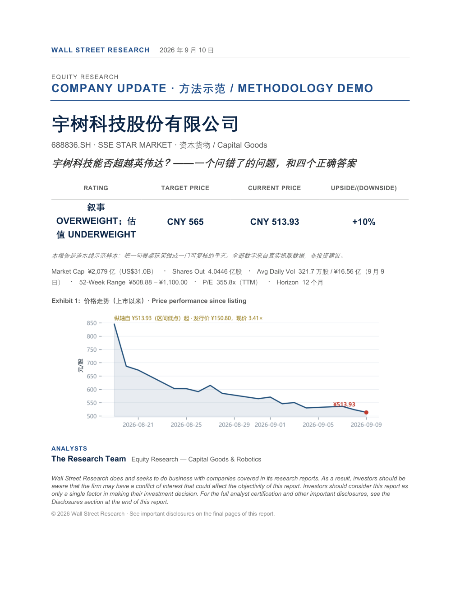
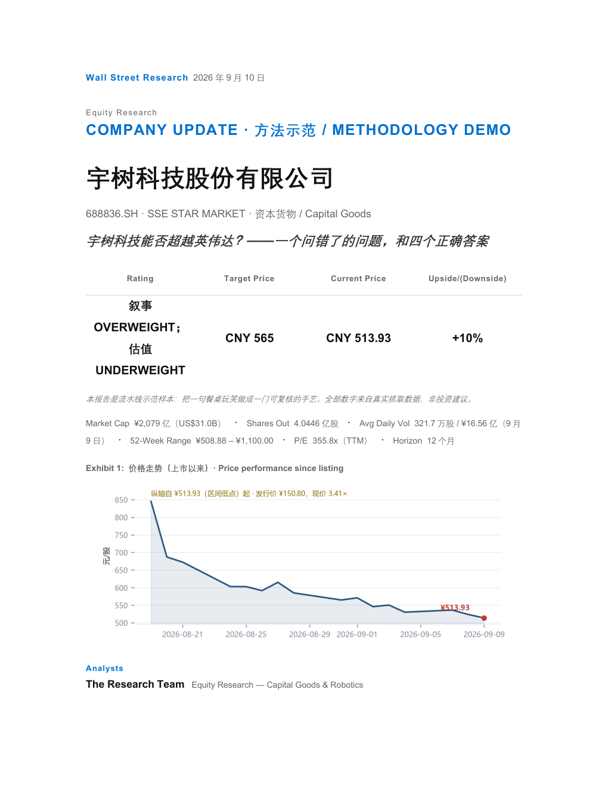
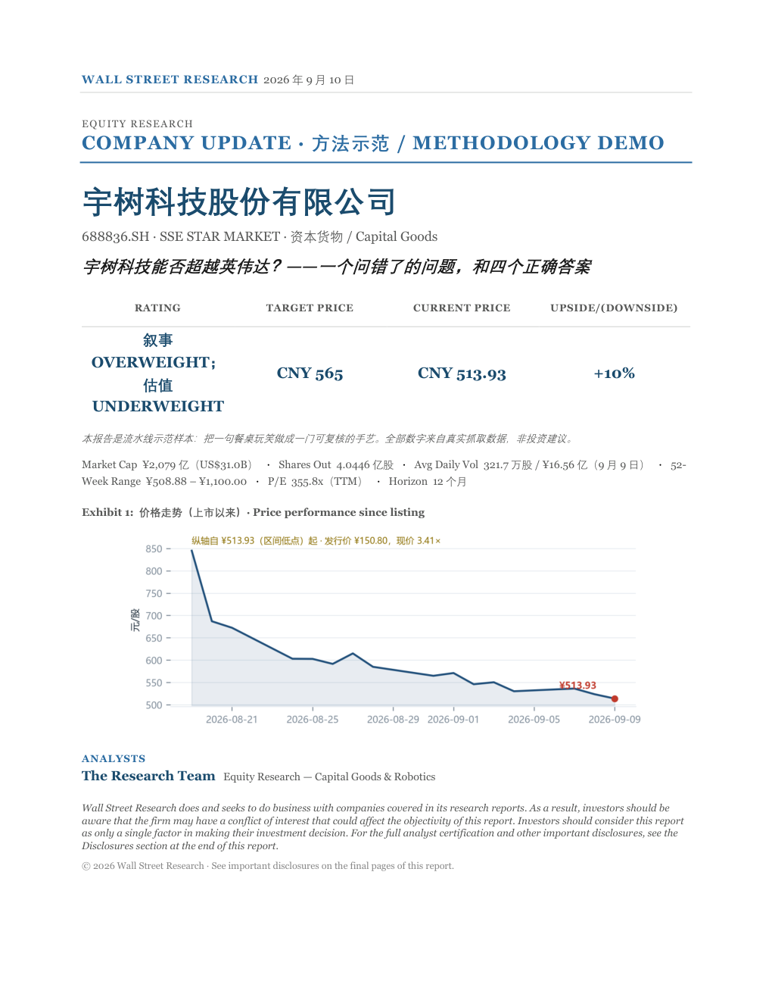
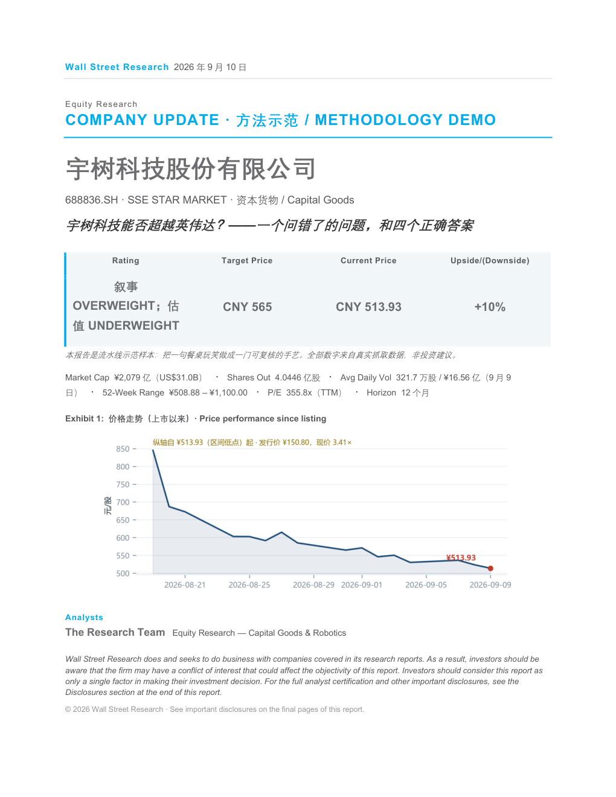
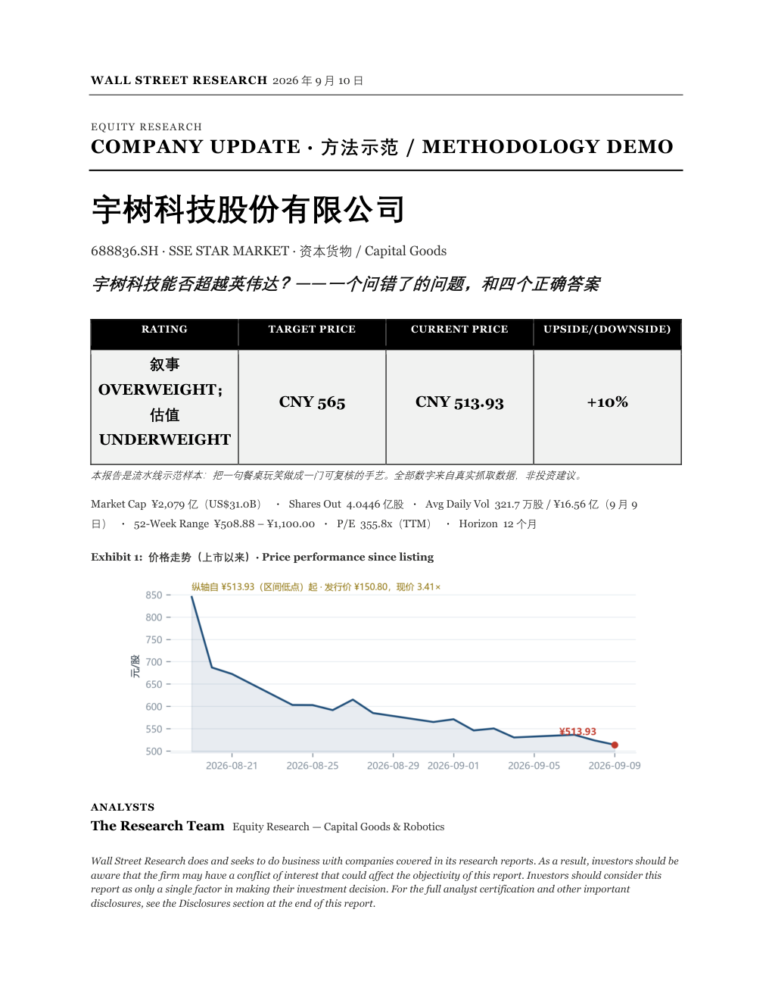
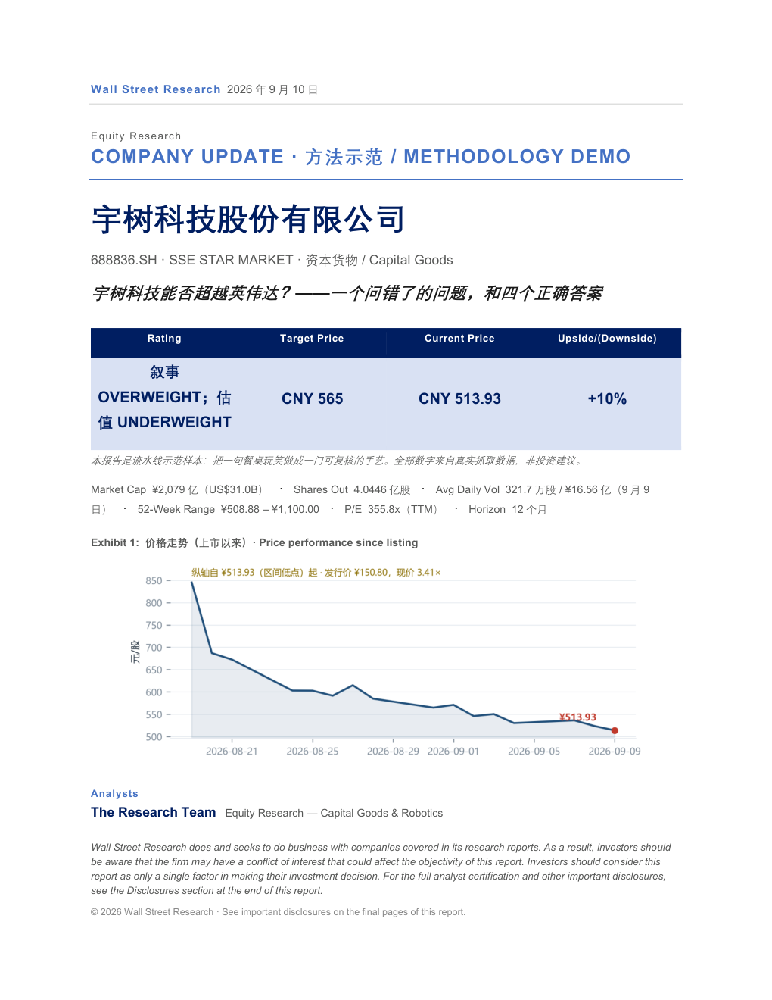
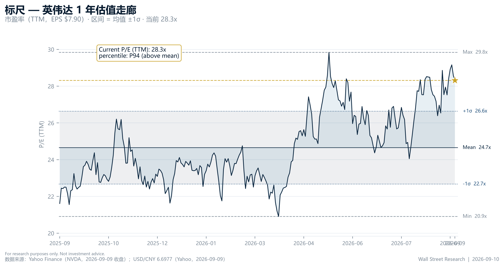
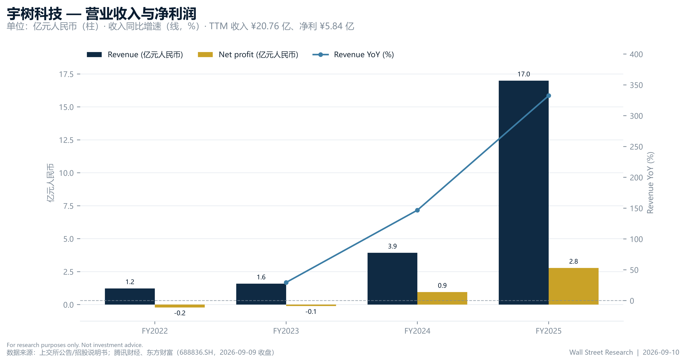
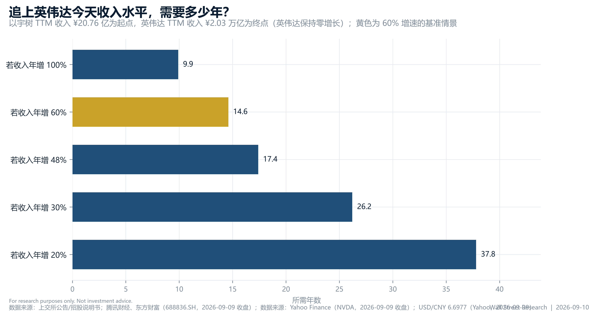

<div align="center">

# wallstreetype-research

**把一句餐桌玩笑，做成一条可复核的流水线。**

### *You can work for Wall Street.*


[中文](README.md) · [English](README_EN.md) · [方法论手册](methodology/wallstreet_paradigm_manual.md) · [案例 PDF](examples/unitree_vs_nvidia/unitree_vs_nvidia.pdf)

</div>

---

## 0. 三十秒版

`wallstreetype-research` 是一条**自包含、agent 无关**的股票研报流水线：

> **输入**：标的 + 市场 + 语言 + 深度档位 + 版式模板
> **输出**：一份华尔街风格的深度研报（Markdown → Word / PDF，500 dpi 图表）

方法论来自 **100 篇真实卖方研报**的五维凝练（10 组 × 10 篇 → 一本 7 章范式手册）；
数字来自**真实双市场接口**（美股 Yahoo Finance，A 股腾讯 + 东方财富），**不需要任何 API key**；
图表是**机构风格**（5 类图）；版式是**卖方范式**（6 套匿名化模板）。

它不是"让 AI 写一篇研报"，而是"**把研报这件事拆成 10 个阶段、8 个角色、每一格都有人负责**"。

```bash
git clone https://github.com/lss680455-create/wallstreetype-research.git
cd wallstreetype-research && pip install -r requirements.txt

# 抓真实数据 → 出图 → 渲染成 Word/PDF
python scripts/data/data_fetcher.py cn 688836 all --json
python templates/md_to_docx.py examples/unitree_vs_nvidia/unitree_vs_nvidia.md --pdf --style goldman_hardline
```

---

## 1. 为什么会有这个项目

有人问：**宇树科技能不能超越英伟达？**

这是个真实存在于饭桌上、微信群里、以及某些卖方晨会里的问题。它听起来很燃，但它其实是一个**没定义清楚的问题**——就像问"一只刚学会后空翻的机器狗能不能超越一支军队"。

要回答它，你得先说清楚：**用哪把尺子。**

而"说清楚用哪把尺子、把每把尺子的数字找出来、再把结论写成别人能复核的格式"——**这件事本身就是华尔街的手艺。**

所以这个项目想做的，是把这门手艺拆开、摆平、配上工具，让任何人都能跑一遍。**包括你。**

---

## 2. 六个版式模板

六套**纯版式**预设（字体 / 配色 / 间距 / 表格处理 / 报头），来自公开研报的视觉特征提取，
**不含任何机构 logo、字样或文本标记**。用 `--style <id>` 一键切换。

<table>
<tr>
<td width="50%" align="center"><br><b>goldman_hardline</b><br>高盛（硬朗风）<br><sub>开放式无框；衬线大标题+无衬线正文；深蓝强调；细线分区；高信息密度。<br>适用：机构级深度报告、数据密集型。</sub></td>
<td width="50%" align="center"><br><b>morganstanley_restrained</b><br>摩根士丹利（克制风）<br><sub>大留白单栏；轻字重大标题；单一蓝点缀；宽边距。<br>适用：论点驱动的叙事型长文。</sub></td>
</tr>
<tr>
<td width="50%" align="center"><br><b>jpmorgan_heavyset</b><br>摩根大通（厚重风）<br><sub>高密度双栏；粗无衬线标题+衬线正文；灰蓝强调；紧凑行距。<br>适用：全链条报告、大量表格与附录。</sub></td>
<td width="50%" align="center"><br><b>barclays_cyanline</b><br>巴克莱（青蓝风）<br><sub>青色页眉带；浅蓝信息栏；青底白字表头；中高密度。<br>适用：要点+侧栏数据、图表多。</sub></td>
</tr>
<tr>
<td width="50%" align="center"><br><b>bernstein_monochrome</b><br>伯恩斯坦（学术黑白风）<br><sub>纯黑白；黑顶栏；衬线正文；紧凑网格。<br>适用：学术/量化研究、黑白打印。</sub></td>
<td width="50%" align="center"><br><b>ubs_swissminimal</b><br>瑞银（瑞士极简风）<br><sub>双层标题色带；深海军蓝+浅蓝；宽边距。<br>适用：高端克制的机构风格。</sub></td>
</tr>
</table>

<sub>上图为**同一篇案例报告**（宇树科技，见 §3）用六套模板渲染出的封面。想看内页效果？每套模板都有 `_page.png` 版本在 [`docs/assets/styles/`](docs/assets/styles/)。</sub>

```bash
python scripts/intake/intake.py --list          # 列出六套模板
python templates/md_to_docx.py my_report.md --pdf --style ubs_swissminimal
```

**自己加一套？** 复制任意 `templates/styles/*.json` → 改 `id` 与字段（文件名必须等于 `id`）→ 直接可用。
完整字段说明见 [`templates/styles/README.md`](templates/styles/README.md)。

---

## 3. 案例：宇树科技能否超越英伟达？

> 一篇完整的示范报告：[`examples/unitree_vs_nvidia/`](examples/unitree_vs_nvidia/)
> ｜ [Markdown](examples/unitree_vs_nvidia/unitree_vs_nvidia.md)
> ｜ [Word](examples/unitree_vs_nvidia/unitree_vs_nvidia.docx)
> ｜ [PDF（7 页）](examples/unitree_vs_nvidia/unitree_vs_nvidia.pdf)

**结论先给：** 用"市值 / 收入 / 利润"这三把尺子，**不能，短期内完全不能**；
用"想象力定价"这把尺子，**它上市第一天就已经做到了**。

### 四把尺子

| 尺子 | 宇树科技 (688836.SH) | 英伟达 (NVDA) | 差距 |
|---|---|---|---|
| 市值 | ¥2,079 亿（US$31.0B） | US$5.40 万亿（¥36.2 万亿） | **174×** |
| 收入 (TTM) | ¥20.76 亿 | ¥2.03 万亿 | **978×** |
| 净利 (TTM) | ¥5.84 亿 | ¥1.28 万亿 | **2,187×** |
| 机器人出货量 | 数以万计 | 0（英伟达不造机器人） | **宇树 1 : 0 领先** |
| 估值倍数 (P/S) | 100.1× | 17.8× | **宇树"赢麻了"** |

> 想让股价在市值上追平英伟达？每股需要涨到 **¥89,437**。从 ¥513.93 出发，约 **174 倍**。

### 六张图

| | |
|---|---|
| <br><sub>**Exhibit 1** 三把尺子的差距（对数刻度）</sub> | <br><sub>**Exhibit 2** 上市 16 日：-53%</sub> |
| <br><sub>**Exhibit 3** 英伟达的估值走廊 vs 宇树的"如果"</sub> | <br><sub>**Exhibit 4** 收入与利润：好公司，贵股票</sub> |
| <br><sub>**Exhibit 5** 概率加权目标价 ¥565</sub> | <br><sub>**Exhibit 6** 追上"今天"的英伟达，需要多久？</sub> |

**追赶时间表**（假设英伟达原地不动）：

| 宇树年增速 | 情景 | 追上英伟达**今天**收入所需年数 |
|---|---|---|
| 100% | 梦幻 | 9.9 年 |
| 60% | 乐观 | 14.6 年 |
| 48% | 2026H1 实际 | 17.4 年 |
| 30% | 成熟期 | 26.2 年 |
| 20% | 制造业主流 | 37.8 年 |

而如果英伟达继续增长——它 TTM 收入同比 **+105.9%**——这张表会立刻从"追赶"变成"追不上"。

### 数字从哪来

案例里**没有一个手打数字**。三步全自动：

```bash
python scripts/data/data_fetcher.py cn 688836 all --json   # ① 抓真实数据
python examples/unitree_vs_nvidia/compute_numbers.py       # ② 算出所有指标
python examples/unitree_vs_nvidia/make_case_charts.py      # ③ 出六张图 + 封面图
```

原始 JSON（`data/*.json`）、计算脚本、六张图表、渲染好的 Word/PDF 全部在
[`examples/unitree_vs_nvidia/`](examples/unitree_vs_nvidia/)，可逐格复核。

---

## 4. 快速开始

```bash
# 0. 安装
pip install -r requirements.txt

# 1. 抓数据（美股走 Yahoo，A 股走腾讯+东财，无需 API key）
python scripts/data/data_fetcher.py us NVDA all --json
python scripts/data/data_fetcher.py cn 688836 financials --json

# 2. 选版式（六选一）
python scripts/intake/intake.py --list

# 3. 渲染（Markdown → Word / PDF）
python templates/md_to_docx.py my_report.md -o out/report.docx --pdf --style jpmorgan_heavyset

# 4. 生成全部图表示例（5 类图，500 dpi）
python scripts/charts/report_charts.py
```

**A 股 / 美股一键切换**：`cn 688836` / `us NVDA`——同一个接口，两套数据源，字段统一。

**网络提示**：美股数据在国内可能需要代理（`export YAHOO_PROXY=socks5h://127.0.0.1:10808`）。
A 股直连即可。

---

## 5. 架构：10 个阶段，8 个角色

```
主 agent ── S0 需求受理 ── S1 任务信封 ── S2 角色简报 ─┬── [子] 数据工程师  ─┐
                                                       ├── [子] 行业分析师  ┼── 并行 ── S5 主 agent 仲裁
                                                       ├── [子] 估值分析师  │
                                                       └── [子] 红队质询官 ─┘
                              S6 [子] 图表师 ─ S7 [子] 排版师 ─ S8 主 agent 终检 ─ S9 校对质检（视觉复核门）─ 交付
```

| 阶段 | 负责 | 产出 |
|---|---|---|
| **S0** 需求受理 | 主 agent（**绝不外包**） | `brief/intake.json`：版式模板 + 研究侧重问卷 |
| **S1** 任务信封 | 主 agent | `envelope.json`：任务契约，所有简报的唯一输入 |
| **S2** 角色简报 | 主 agent | 每个角色一份双语简报 |
| **S3–S4** 并行研究 | 数据工程师 / 行业分析师 / 估值分析师 / 红队 | 数据、行业、估值、质询 |
| **S5** 仲裁 | 主 agent | 裁决分歧，**只有主 agent 能改结论** |
| **S6–S7** 出图与排版 | 图表师 / 排版师 | `charts/fig_*.png`、`final/report.*` |
| **S8–S9** 终检与质检 | 主 agent | 视觉复核门：逐页渲染 + 数字引用表交叉核对 |

**8 个角色的透镜互不重叠**：数据工程师不写结论，行业分析师不碰估值，红队只质疑不修改，
校对员只验证不编辑。**主 agent 是唯一的编排者与仲裁者。**

方法论资产：

| 资产 | 位置 | 内容 |
|---|---|---|
| 范式手册 | [`methodology/wallstreet_paradigm_manual.md`](methodology/wallstreet_paradigm_manual.md) | 7 章：论证骨架 / 方法总库 / 行文范式 / 图表规范 / 证据纪律 / 红旗清单 / 红队质询库 |
| 100 篇研报清单 | [`methodology/report_list_100.md`](methodology/report_list_100.md) | 可溯源的方法论种子库 |
| 10 组凝练 | [`methodology/digests/`](methodology/digests/) | 每篇五维凝练（方法 / 行文 / 图表 / 动作 / 教训） |
| 阶段编排 | [`pipeline/pipeline_orchestration.md`](pipeline/pipeline_orchestration.md) | 10 阶段的输入输出、单一写入者、质量门 |
| 角色简报 | [`pipeline/agent_prompts.md`](pipeline/agent_prompts.md) | 8 个角色 × 双语简报模板 |
| 需求受理 | [`pipeline/intake.md`](pipeline/intake.md) | S0 问卷：模板选择 + 研究侧重 |

> **agent 无关**：这套流程不绑定任何一家 AI。你可以用 Codex、Claude Code、Cursor、Hermes，
> 也可以……**自己动手**。所有产物都是文件，没有黑箱。

---

## 6. 目录结构

```
wallstreetype-research/
├── README.md / README_EN.md      # 中英文双版说明
├── SKILL.md                      # skill 定义（可直接装进 agent）
├── requirements.txt
├── methodology/                  # 方法论资产
│   ├── wallstreet_paradigm_manual.md   # 7 章范式手册
│   ├── report_list_100.md              # 100 篇研报清单
│   └── digests/group1..10.md           # 10 组五维凝练
├── pipeline/                     # 流水线编排
│   ├── pipeline_orchestration.md       # S0–S9
│   ├── agent_prompts.md                # 8 角色双语简报
│   └── intake.md                       # S0 需求受理
├── scripts/
│   ├── data/                     # 数据层：Yahoo / 腾讯 / 东财，无 API key
│   ├── charts/                   # 图表层：5 类机构风格图，500 dpi
│   └── intake/                   # 需求受理 CLI
├── templates/
│   ├── md_to_docx.py             # Markdown → Word / PDF 渲染器
│   ├── report_template.md        # 研报骨架（含 frontmatter 字段说明）
│   └── styles/*.json             # 六套版式模板
├── examples/
│   ├── nvda_demo/                # 美股示范：英伟达
│   ├── unitree_vs_nvidia/        # 双语案例：宇树 vs 英伟达（本 README §3）
│   └── layout_demo/              # 版式最小示例
└── docs/assets/                  # README 用图（六套模板封面 + 案例图表）
```

---

## 7. 三层工具

| 层 | 位置 | 能力 |
|---|---|---|
| **数据层** | [`scripts/data/`](scripts/data/) | 美股（Yahoo）/ A 股（腾讯 + 东财）行情、历史（前复权）、财务；**免费、无 key、可追溯** |
| **图表层** | [`scripts/charts/`](scripts/charts/) | 5 类图：K 线+成交量、估值带、财务趋势、情景柱、同业对比；matplotlib + mplfinance，500 dpi 静态 PNG |
| **版式层** | [`templates/`](templates/) | Markdown → Word / PDF；六套版式模板；封面评级框、Key Data、页眉页脚、披露页全套 |

**为什么不用 plotly / finplot？** 因为交付物是**要嵌进 Word/PDF 的 500 dpi 静态图**，不是交互式控件。
选型对比见 [`scripts/charts/README.md`](scripts/charts/README.md)。

---

## 8. "You can work for Wall Street"

这个项目叫 `wallstreetype-research`——**"-type"** 是刻意的：
它不是华尔街，它只是**像**华尔街。

| 常见质疑 | 回答 |
|---|---|
| "我没有金融背景，能用吗？" | **能。** 这正是它存在的理由：把华尔街的手艺拆成可执行的步骤。 |
| "我没有 Bloomberg 终端。" | 不需要。数据层用的是免费公开接口。 |
| "我不会写代码。" | 三步命令。真要手写，`report_template.md` 就是一份填空表。 |
| "AI 写的研报能信吗？" | 单看 AI 写的不能。所以这里有红队、有引用表、有视觉复核门、有"数字未登记=违规范"的硬规则。 |
| "这能直接发出去吗？" | 不能。它是**方法示范**，不是投资建议。 |
| "那到底谁能在华尔街工作？" | 能把问题问对、把数字找齐、把结论写成别人能复核的人。**和学历无关。** |

---

## 9. 可复核性

- **数据**：全部来自公开接口，原始 JSON 落盘（`examples/*/data/*.json`），不合成、不外推。
- **数字**：案例所有指标由脚本从原始 JSON 计算（`compute_numbers.py`），**无一枚手打数字**。
- **引用**：每张图带数据来源脚注；报告正文的每个数字都要在 `sources.json` 登记，否则 S9 质检判违规。
- **质检**：S9 用**纯视觉模型**逐页渲染复核（≥144 dpi，疑点放大 2× 再核），
  独立核验报告见 [`VERIFICATION.md`](VERIFICATION.md)。

---

## 10. 免责声明与许可

- **非投资建议。** 本项目为方法与工程示范，不构成任何证券的买卖建议。
- **版式模板仅为版式参考**：字体、配色、间距等视觉特征提取自公开研报；
  **不含任何机构 logo、字样、水印或分析师署名**，与任何机构无关联、无背书。
- **数据来源**：Yahoo Finance（美股）、腾讯财经 / 东方财富（A 股）。数据可能存在延迟或错误，使用前请自行核对。
- **许可**：MIT。见 [`LICENSE`](LICENSE)。

<div align="center">
<br>
<sub>把问题问对，比把答案说漂亮更难。</sub><br>
<sub><b>— wallstreetype-research</b></sub>
</div>
