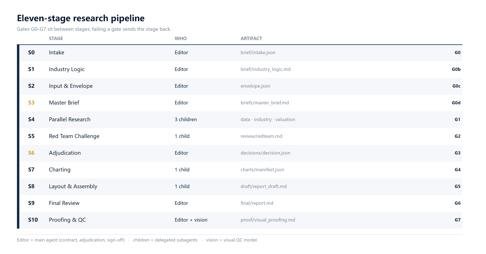
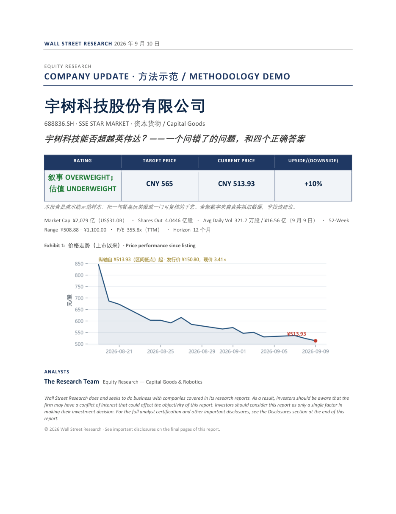
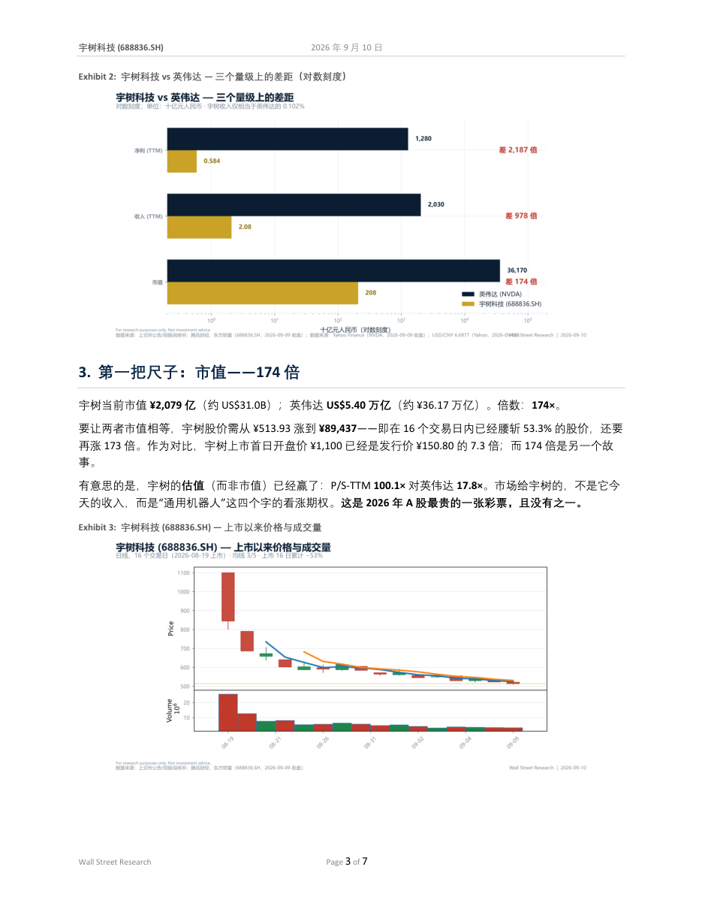

<div align="center">


[中文](README.md) · [**English**](README_EN.md) · [Features](#what-it-does) · [Quick start](#quick-start) · [Usage](#usage) · [Architecture](#architecture) · [Layouts](#the-six-layout-templates) · [Showcase](#showcase) · [Docs](#documentation)

</div>

---

## What it does

**wallstreetype-research** is an open-source toolkit that turns sell-side research production into an engineering workflow: hand it a ticker, get back a report you could actually deliver — cover page, rating box, key-data table, numbered sections, institutional-grade charts, exported to Word and PDF.

The methodology, market data, charting, page layout and quality gates are all shipped as **runnable scripts and specs** rather than prose. The pipeline is model-agnostic: any AI agent that can read files and run scripts can drive it, and a human following the docs works just as well.

---

## Features

- 📚 **Methodology library** — a 124-line breakdown of 100 sell-side reports, 10 thematic digests, and a 550-line Wall Street paradigm manual covering research logic, evidence discipline and red-flag checklists. → [`methodology/`](methodology)
- 📈 **Dual-market data layer** — US and A-share quotes, price history and financials behind one command, with **zero API keys**. → [`scripts/data/`](scripts/data)
- 📊 **Five chart families** — price + volume candles, valuation band, dual-axis financial trend, scenario bars, peer comparison, all sharing one house style. → [`scripts/charts/`](scripts/charts)
- 🔀 **Eleven-stage pipeline (S0–S10)** — 11 stages, 8 role lenses, 8 quality gates, structured hand-off artifacts. → [`pipeline/`](pipeline)
- 🧭 **Industry logic first** — before a word is written, the industry chain is mapped (how the company earns / where it sits / what drives it / how it transmits / where in the cycle) and the user gets **5–6 direction questions** (horizon, primary driver, assumption anchor, real competitor, falsification, output orientation). A direction the user never gave is not silently defaulted. → [`pipeline/logic_mapping.md`](pipeline/logic_mapping.md)
- 📄 **Markdown → Word / PDF engine** — generates the cover, rating box, key-data table, table of contents, numbered sections and embedded figures, with CJK-aware fonts. → [`templates/md_to_docx.py`](templates/md_to_docx.py)
- 🎨 **Six institutional layouts** — each one a complete JSON definition of fonts, palette, layout, tables and rating box; tweak a copy and you have a new template. All firm names and marks removed. → [`templates/styles/`](templates/styles)
- ✅ **Verifiable output** — every claim maps to a reproducible action, and the final gate renders the finished document to images for page-by-page visual review. Repo self-check in one command: `python scripts/verify_consistency.py`. → [`VERIFICATION.md`](VERIFICATION.md)

---

## Quick start

```bash
# 0. Dependencies (pandas / matplotlib / python-docx / mplfinance, ...)
pip install -r requirements.txt

# 1. Write: copy the report skeleton and fill in your content
#    (the YAML front matter drives the cover page and rating box)
cp templates/report_template.md my_report.md

# 2. Export: Markdown → Word (+ PDF) in any of the six layouts
python templates/md_to_docx.py my_report.md --style goldman_hardline --pdf --toc
```

That produces `my_report.docx` and `my_report.pdf`. Switching layout is a one-parameter change:

```bash
python templates/md_to_docx.py my_report.md --style barclays_cyanline    --pdf
python templates/md_to_docx.py my_report.md --style bernstein_monochrome --pdf
python templates/md_to_docx.py my_report.md --style ubs_swissminimal     --pdf
python templates/md_to_docx.py my_report.md --style /path/to/your_own.json --pdf
```

---

## Usage

**Market data** (US / A-share; `quote`, `history`, `financials`, `all`)

```bash
python scripts/data/data_fetcher.py cn 600519 all --json        # Kweichow Moutai, everything
python scripts/data/data_fetcher.py us NVDA financials --json   # NVIDIA, financials
export YAHOO_PROXY=socks5h://127.0.0.1:10808                    # proxy for US data behind the GFW
```

**Charts** (runnable samples for all five families)

```bash
python scripts/charts/report_charts.py       # → scripts/charts/sample_pngs/
```

**Run the whole pipeline** — hand this to any AI agent, or follow it yourself:

```text
Read pipeline/pipeline_orchestration.md. Start with S0 (intake) and S1 (industry logic
mapping + the 5–6 direction questions — the run does not begin until they are answered),
then produce an in-depth research report on <COMPANY> by following S2–S10, using the
ubs_swissminimal layout and scripts/data/ for dual-market data. Write every stage artifact
to the workspace, and send a stage back whenever its gate fails.
```

**Direction check before the run (S1)** — nail the logic down before any research starts:

```bash
python scripts/intake/direction_check.py --questions                                 # print the six questions
python scripts/intake/direction_check.py --skeleton > brief/direction_confirmed.json # blank template
python scripts/intake/direction_check.py --check    brief/direction_confirmed.json   # gate G0b
```

| # | Question | Answers |
|---|---|---|
| Q1 | View & horizon | trading (≤3m) / fundamental (6–12m) / industrial trend (3y+) |
| Q2 | Primary driver | pick the axis among the 2–3 candidate drivers — rewrite or add your own |
| Q3 | Assumption anchor | company guidance / consensus / your own range / historical extrapolation |
| Q4 | The real competitor | direct peer / substitute technology / adjacent giant (multi-select) |
| Q5 | Falsification | the observable signal that would make you drop the thesis (shipments, gross margin, orders, ASP, utilisation…) |
| Q6 | Output orientation | valuation-driven / event-driven / thematic, plus emphasis on growth · risk · valuation |

The answers are wired into the run, not filed away: `view` sets the valuation window and the weight of multiples vs DCF vs scenario, `primary_driver` is the thesis axis, `assumption_anchor` sets the base case, and `falsification` becomes the Red Team's brief. **These six are never answered on the user's behalf** — an unanswered direction runs as `direction_assumed: true` with every assumed value disclosed on the cover.

---

## Architecture



`pipeline/pipeline_orchestration.md` (756 lines) defines the inputs, outputs, owning role and gate checklist for every stage; `pipeline/agent_prompts.md` (854 lines) holds bilingual briefs for all eight roles; `pipeline/logic_mapping.md` (242 lines) is the full spec of the S1 ring — the five-move industry map plus the six questions; `pipeline/intake.md` (201 lines) is the S0 form. Three depth tiers (quick brief / standard single-company / deep thematic) trim the same flow — you don't run the full thing every time (S0 and S1 excepted: no tier skips the direction check).

**Eight roles** (lens boundaries, not job titles — one agent can wear several hats, but a single hat can't argue both sides of the trade)

| Role | Lens |
|---|---|
| Editor-in-Chief | Global view, contracts, adjudication, sign-off |
| Data Engineer | Where numbers come from, whether they recompute |
| Industry Analyst | Value-chain position, supply/demand, competition |
| Valuation Analyst | Multiples, DCF, comparables |
| Red Team | Exists only to tear the thesis down |
| Chart Specialist | One chart, one message |
| Layout Artist | Pagination, hierarchy, whitespace |
| Proofreader | Page-by-page visual review |

**Repository layout**

```text
wallstreetype-research/
├── methodology/                 research logic: 100-report list, digests, paradigm manual
├── pipeline/                    pipeline specs (model-agnostic)
│   ├── pipeline_orchestration.md  stage specs / gates / artifacts
│   ├── agent_prompts.md           8 role briefs (EN + ZH)
│   ├── logic_mapping.md           S1 industry map + the six direction questions
│   └── intake.md                  topic + layout questionnaire
├── scripts/
│   ├── data/                    dual-market fetching (no keys)
│   ├── charts/                  5 chart families
│   ├── layout/                  layout layer documentation
│   └── intake/                  questionnaire / direction contract (direction_check.py, gate G0b)
├── templates/
│   ├── report_template.md       report skeleton (YAML front matter)
│   ├── md_to_docx.py            Markdown → Word / PDF
│   └── styles/*.json            6 institutional layout definitions
├── examples/                    three reproducible examples (incl. end-to-end case)
├── docs/assets/                 README artwork (covers / architecture / case output)
├── VERIFICATION.md              acceptance checklist
└── README.md · README_EN.md
```

---

## The six layout templates

The visual language is drawn from publicly available research notes with **all firm names and marks removed** — only the typesetting survives. Below: the same report rendered as a cover in each of the six layouts; click through for an interior page.

<table>
<tr>
<td width="33%" align="center"><br><b>Hardline</b><br><sub>Open, frameless; large serif display type; navy accents; hairline rules; high density</sub><br><a href="docs/assets/styles/goldman_hardline_page.png">Interior →</a></td>
<td width="33%" align="center"><br><b>Restrained</b><br><sub>Airy single column; light display type; one blue accent; wide margins</sub><br><a href="docs/assets/styles/morganstanley_restrained_page.png">Interior →</a></td>
<td width="33%" align="center"><br><b>Heavyset</b><br><sub>Dense two-column; heavy sans headings + serif body; grey table headers; tight leading</sub><br><a href="docs/assets/styles/jpmorgan_heavyset_page.png">Interior →</a></td>
</tr>
<tr>
<td align="center"><br><b>Cyan Line</b><br><sub>Cyan header band; pale-blue side rail; cyan table headers; light display type</sub><br><a href="docs/assets/styles/barclays_cyanline_page.png">Interior →</a></td>
<td align="center"><br><b>Monochrome</b><br><sub>Strict black and white; black top bar; serif body; tight grid</sub><br><a href="docs/assets/styles/bernstein_monochrome_page.png">Interior →</a></td>
<td align="center"><br><b>Swiss Minimal</b><br><sub>Double title bands; navy + light blue; right-hand info rail; wide margins</sub><br><a href="docs/assets/styles/ubs_swissminimal_page.png">Interior →</a></td>
</tr>
</table>

---

## Showcase

[`examples/unitree_vs_nvidia/`](examples/unitree_vs_nvidia) is one complete run: **can Unitree Robotics `688836.SH` (STAR Market) ever surpass NVIDIA `NVDA` (NASDAQ)?** — from raw data to a laid-out document in the `goldman_hardline` layout.

[PDF (7 pages)](examples/unitree_vs_nvidia/unitree_vs_nvidia.pdf) · [Word](examples/unitree_vs_nvidia/unitree_vs_nvidia.docx) · [Markdown source](examples/unitree_vs_nvidia/unitree_vs_nvidia.md) · [six figures](examples/unitree_vs_nvidia/figures) · [raw data](examples/unitree_vs_nvidia/data) · [proofing renders](examples/unitree_vs_nvidia/proof) · [reproduction scripts](examples/unitree_vs_nvidia/README.md)

<table>
<tr>
<td width="50%"></td>
<td width="50%"></td>
</tr>
<tr>
<td align="center"><sub>Page 1 · cover</sub></td>
<td align="center"><sub>Page 3 · interior</sub></td>
</tr>
</table>

<table>
<tr>
<td width="33%"></td>
<td width="33%"></td>
<td width="33%"></td>
</tr>
<tr>
<td align="center"><sub>Peer comparison (log scale)</sub></td>
<td align="center"><sub>Price + volume</sub></td>
<td align="center"><sub>Financial trend (dual axis)</sub></td>
</tr>
</table>

---

## Documentation

| Document | Contents |
|---|---|
| [`pipeline/pipeline_orchestration.md`](pipeline/pipeline_orchestration.md) | Eleven-stage flow, gate checklists, artifact formats |
| [`pipeline/logic_mapping.md`](pipeline/logic_mapping.md) | S1: the five-move industry map and the six direction questions |
| [`pipeline/intake.md`](pipeline/intake.md) | S0: layout and focus questionnaire |
| [`pipeline/agent_prompts.md`](pipeline/agent_prompts.md) | Bilingual brief templates for the eight roles |
| [`methodology/wallstreet_paradigm_manual.md`](methodology/wallstreet_paradigm_manual.md) | Paradigm manual: research logic, evidence discipline, red flags |
| [`templates/styles/README.md`](templates/styles/README.md) | Layout fields and how to author your own |
| [`scripts/data/README.md`](scripts/data/README.md) · [`scripts/charts/README.md`](scripts/charts/README.md) | Data interfaces and chart functions |
| [`VERIFICATION.md`](VERIFICATION.md) | Acceptance action for every deliverable |

---

## Disclaimer

This project is a **methodology and document-engineering demonstration**. Nothing here is investment advice. Data comes from public interfaces and is provided for reference only — always defer to exchange filings and company disclosures. The layout templates are typesetting references containing no firm names or marks, and are not affiliated with or endorsed by any institution.

## License

[MIT](LICENSE) · *You can work for Wall Street.*
