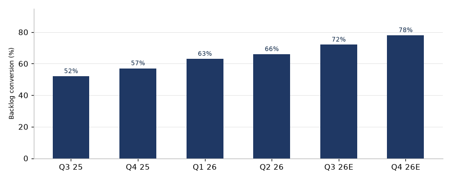

# Executive Summary

We initiate coverage of **Acme Industrial Holdings (ACME, NASDAQ)** with an **OVERWEIGHT** rating and a **USD 78.00 twelve-month target price**, implying **+22% upside/(downside)** from the current price of USD 64.00. Our rating is relative to the coverage universe over the stated horizon, consistent with the rating definitions in the Recommendation section.

**What's changed.** Initiation of coverage: no prior rating or target price. We establish FY2026E revenue of $1,560M (+13% y/y) and EPS of $3.28, 4% above consensus, driven by automation backlog conversion.

**Investment thesis.** Our thesis rests on three pillars: (1) margin expansion from the automated manufacturing rollout completing Q3 2026, (2) backlog conversion acceleration fueled by infrastructure-spending tailwinds, and (3) an underappreciated aftermarket revenue inflection as the installed base matures.

**Key risks.** Steel input-cost volatility, customer concentration (top-3 accounts ≈ 38% of revenue), and a slower-than-expected manufacturing upcycle.

**Financial highlights (illustrative):**

| Metric | FY2024A | FY2025A | FY2026E | FY2027E |
| --- | --- | --- | --- | --- |
| Revenue (USD M) | 1,240 | 1,380 | 1,560 | 1,720 |
| EBITDA margin (%) | 14.2 | 15.8 | 17.5 | 18.3 |
| EPS (USD) | 1.92 | 2.35 | 3.28 | 3.95 |
| FCF yield (%) | 5.1 | 6.2 | 8.4 | 10.1 |
| Net debt/EBITDA (x) | 1.8 | 1.4 | 0.9 | 0.5 |

Source: Company data, WSR Research estimates.

# Company Overview

## Business Model

ACME designs and manufactures industrial automation systems for discrete and process manufacturing. Revenue splits roughly 62% equipment, 24% aftermarket parts & services, and 14% software & connectivity. The aftermarket mix is the strategic priority: it carries 2–3x the gross margin of equipment and is the most defensible line as the installed base compounds.

## Industry & Market Position

The global industrial automation market is ~$180B, growing high-single-digit annually. ACME ranks #4 by share with ~6.5%, behind three larger diversified peers but ahead of most pure-play rivals. Its differentiation is vertical-software depth — roughly 40% of new equipment orders ship with a software subscription attach, versus a low-teens industry average.

## Management

The CEO (since 2019) has a 20-year operating history at ACME; the CFO joined in 2022 from a large-cap industrial. Management has guided to a 15–17% long-term EBITDA margin framework and a 30–40% payout ratio. We view execution risk around the Q3 2026 manufacturing rollout as the key management watch-item.

# Financial Analysis

## Revenue

Equipment revenue is cyclical but backlog visibility is strong: the current backlog of $940M covers ~70% of FY2026E equipment revenue. Aftermarket revenue has compounded at 14% over FY2021–25A and should inflect further as the installed base grows.

## Margins & Profitability

FY2025A EBITDA margin of 15.8% reflected commodity headwinds and rollout inefficiencies. We model 17.5% for FY2026E and 18.3% for FY2027E as the automation rollout drives labor-cost savings and mix shifts toward aftermarket.

## Balance Sheet & Cash Flow

Net debt/EBITDA of 1.4x at FY2025A falls to ~0.5x by FY2027E on our estimates, giving the balance sheet optionality for buybacks or M&A. FCF conversion (FCF/net income) has averaged ~85%; we model 90%+ by FY2027E.

### Segment Detail

| Segment | FY2025A Rev (USD M) | FY2026E Rev (USD M) | FY2026E GM (%) | y/y (%) |
| --- | --- | --- | --- | --- |
| Equipment | 856 | 967 | 31 | +13 |
| Aftermarket | 331 | 405 | 52 | +22 |
| Software | 193 | 226 | 68 | +17 |

Source: Company data, WSR Research estimates.

# Valuation

## Methodology

We value ACME on a blend of a base-case DCF (60% weight) and forward EV/EBITDA relative to peers (40% weight), cross-checked against historical multiples and a bull/bear scenario range.

## Discounted Cash Flow

Our base-case DCF assumes a 9.2% WACC, a 2.5% terminal growth rate, and an 18% terminal EBITDA margin, yielding an equity value of ~$4.9B or ~$75/share.

## Comparable Companies

| Company | Ticker | Rating | FY2026E EV/EBITDA (x) | FY2026E P/E (x) | FY2026E FCF Yield (%) |
| --- | --- | --- | --- | --- | --- |
| Acme Industrial | ACME | OW | 11.8 | 18.5 | 8.4 |
| Peer A | PRA | OW | 12.5 | 20.1 | 6.9 |
| Peer B | PRB | EW | 11.0 | 17.2 | 9.3 |
| Peer C | PRC | UW | 9.8 | 15.0 | 11.2 |
| Median |  |  | 11.4 | 17.9 | 8.9 |

Source: FactSet, WSR Research estimates.

## Sensitivity Analysis

| WACC \ Terminal g | 1.5% | 2.5% | 3.5% |
| --- | --- | --- | --- |
| 8.2% | 72 | 82 | 94 |
| 9.2% | 64 | 75 | 86 |
| 10.2% | 58 | 68 | 79 |

Source: WSR Research estimates. Values in USD/share.

## Target Price Derivation

Blending the DCF ($75) and comps ($82) at 60/40 yields a $78.00 target price. **Upside/(downside) to target: +22%.** Our bull case of $92 assumes faster margin delivery and multiple re-rating; our bear case of $52 assumes a demand recession and customer concentration losses.

# Investment Thesis

1. **Margin inflection is visible and underappreciated.** The Q3 2026 automated-manufacturing rollout removes ~600 bps of conversion-cost drag; consensus has not yet modeled the full FY2027E benefit.
2. **Backlog conversion accelerates on infrastructure tailwinds.** Orders tied to reshoring and grid modernization have grown 31% y/y for three consecutive quarters.
3. **Aftermarket revenue inflection compounds.** With the installed base doubling every ~4 years, attach-rate gains in parts and services should sustain 15%+ segment growth through FY2028E.
4. **Multiple re-rating optionality.** ACME screens at an ~8% discount to the median peer on FY2026E EV/EBITDA despite superior growth and FCF generation.

Source: Company disclosures, WSR Research estimates.

# Catalysts & Event Calendar

| Date | Event | Potential Impact |
| --- | --- | --- |
| Q3 2026 | Automation rollout completion | Positive: margin step-change visible |
| Oct 2026 | FY2026 Q3 earnings | Positive if backlog conversion in-line+ |
| Nov 2026 | Investor day | Neutral-to-positive: LT margin framework |
| Feb 2027 | FY2026 results | Key test of 17.5% margin delivery |

# Risk Factors

**Business & operational risks.** Customer concentration (top-3 ≈ 38% of revenue); project-execution risk around large automation deployments; supply-chain exposure to steel and specialty electronics.

**Financial risks.** Commodity-cost inflation pressure on gross margin; FX translation from ~30% non-USD revenue; leverage currently modest but acquisition-driven step-changes possible.

**Regulatory & macro risks.** Trade-policy changes affecting reshoring incentives; cyclicality of manufacturing capex; wage-inflation pass-through limitations.

**Market risks.** Multiple compression in a rising-rate environment; peer de-rating contagion; index-removal risk if free-float liquidity deteriorates.

# Recommendation

## Rating

**OVERWEIGHT** — ACME's total return is expected to exceed the average total return of its industry coverage universe over the next 12 months, on a risk-adjusted basis. **USD 78.00 target price** vs. current price of USD 64.00.

## Rating Definitions

- **Overweight (OW)** — expected to outperform the relevant industry coverage universe over the next 12 months.
- **Equal-weight (EW)** — expected total return in line with the relevant industry coverage universe.
- **Underweight (UW)** — expected to underperform the relevant industry coverage universe.
- **Not Rated (NR)** — coverage not currently assigned.

> Rating scales vary by firm: Goldman Sachs uses Buy/Neutral/Sell plus a Conviction List; Morgan Stanley and J.P. Morgan use Overweight/Equal-weight/Underweight (with Not-Rated). Pick ONE scale, state it, and keep it consistent throughout.

## Key Assumptions to Monitor

1. FY2026E margin delivery path toward 17.5% EBITDA margin.
2. Backlog conversion rate vs. the 70% FY2026E coverage ratio.
3. Aftermarket attach-rate and software renewal metrics.
4. Commodity cost trajectory and pricing power.

**Next catalyst:** Q3 FY2026 earnings (October 2026).

# Analyst Certification

I, Jane Doe, hereby certify that all of the views expressed in this report accurately reflect my personal views about the subject company and its securities, which have not been influenced by considerations of the firm's business or client relationships. My compensation is based on various factors, including research quality, accuracy of estimates, investor feedback, and firm profitability — not on any specific recommendation contained in this report.

# Disclosures & Disclaimer

**Analyst interests.** The analysts responsible for this report do not beneficially own securities of the subject company, except as disclosed. WSR and/or its affiliates may hold positions in, act as market maker for, or perform services for companies covered in this report.

**Nature of this report.** This report is produced for information and educational purposes only. It is not an offer to sell or a solicitation of an offer to buy any security, and it does not constitute investment advice, a personal recommendation, or tax, legal, or accounting advice. It does not take into account the investment objectives, financial situation, or particular needs of any individual recipient. Recipients should make their own independent investment decisions and, where appropriate, seek professional advice.

**Forward-looking statements.** Statements herein that are not historical facts, including target prices, ratings, and financial forecasts, are forward-looking statements based on current estimates and assumptions that involve risks and uncertainties. Actual results may differ materially. Past performance is not a guide to future performance; future returns are not guaranteed, and a loss of original capital may occur. Target prices are expressions of opinion at the date of publication and are subject to change without notice.

**No warranty.** Information in this report is provided "as is" without warranty of any kind, express or implied. Data is believed reliable but is not guaranteed for accuracy or completeness. Third-party data providers make no warranties and shall have no liability for damages relating to such data.

**Distribution.** This report may not be reproduced, redistributed, or republished, in whole or in part, without the prior written consent of WSR Independent Research.

© 2026 WSR Independent Research. All rights reserved.

# Appendix

## A. Rating Distribution (for illustration, FINRA-style)

| Rating Category | Count | % of Total | % of IBC |
| --- | --- | --- | --- |
| Overweight / Buy | 152 | 42 | 47 |
| Equal-weight / Hold | 158 | 43 | 42 |
| Underweight / Sell | 56 | 15 | 10 |
| Total | 366 | 100 | 99 |

## B. Glossary

- **EBITDA** — earnings before interest, taxes, depreciation, and amortization
- **EV/EBITDA** — enterprise value divided by EBITDA
- **FCF yield** — free cash flow divided by market capitalization
- **WACC** — weighted average cost of capital

## C. Data Sources

Company filings (10-K/10-Q/annual reports), company guidance and disclosures, FactSet, consensus estimates, and WSR Research estimates. All figures are in USD unless otherwise stated.
