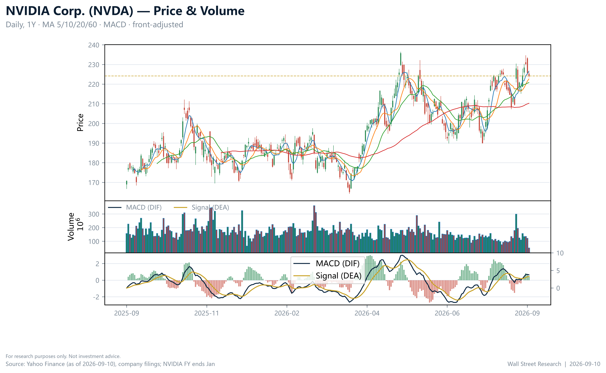
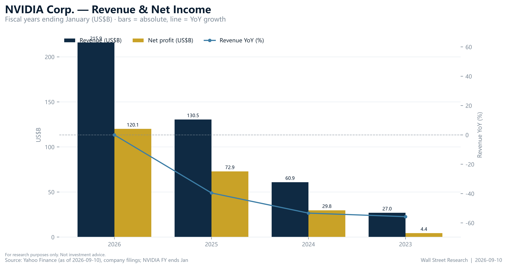
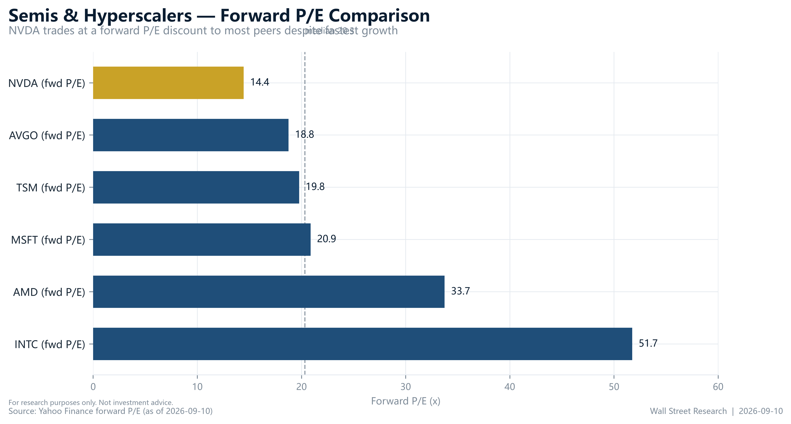
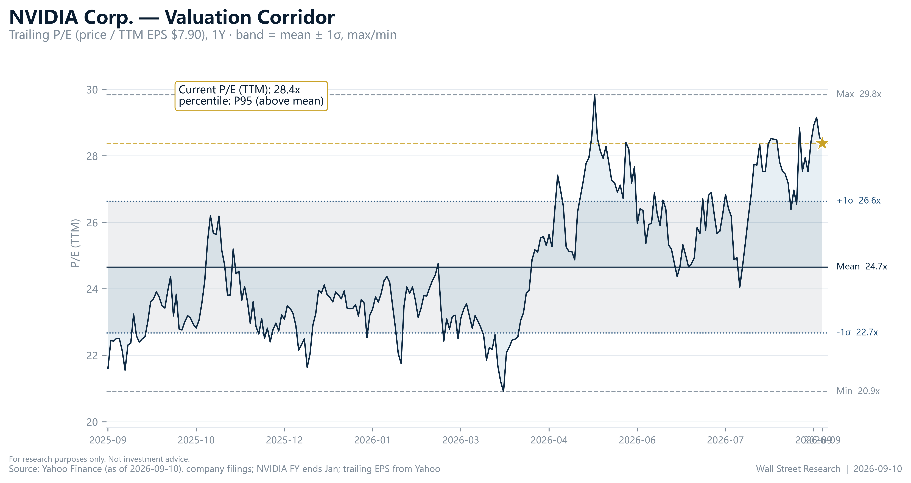
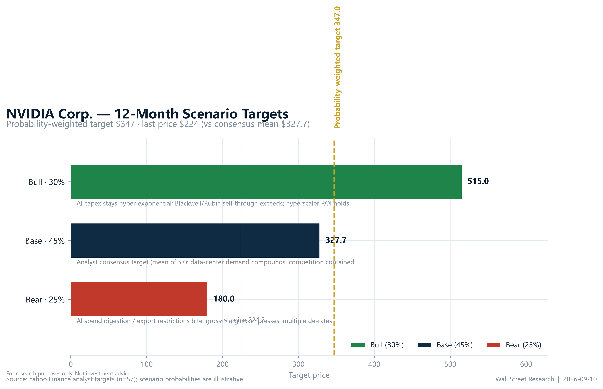

# Executive Summary

We initiate coverage of **NVIDIA Corporation (NVDA, NASDAQ)** with an **OVERWEIGHT (BUY)** rating and a twelve-month target of **US$347** (range $300–$370), **+55% upside** from the September 10, 2026 close of $224.22, 6% above the 57-analyst consensus mean of $327.65 (Yahoo Finance, financialData). The core variable is AI-capex durability: at $224.22 the stock trades at **14.4x forward earnings** (Yahoo Finance, quote) while revenue grows **+105.9% y/y** (Yahoo Finance, financialData) — a ~31% discount to the 20.9x forward peer median (Yahoo Finance, peers). If growth merely holds above +50% y/y the discount closes; if it breaks, the consensus low of $180 bounds the downside.

**What's changed.** Initiation: no prior rating or target. We establish the FY2023–FY2026 baseline (revenue $26.97B→$215.94B; net income $4.37B→$120.07B; Yahoo Finance, income statement history) and target $347 above consensus mean $327.65 on data, not multiple hope: forward EPS $15.52 vs $7.90 trailing, and a forward P/E 31% below the peer median (Yahoo Finance, financialData / quote / peers).

**Investment thesis.** (1) **AI capex converts to revenue with observable lag** — TTM revenue of $302.97B already runs 40% above FY2026 (Yahoo Finance); (2) **product cadence sustains pricing** — Blackwell now, Rubin next, with 74.7% gross and 66.2% operating margins (Yahoo Finance, financialData); (3) **the forward discount to peers is unjustified** — the set's cheapest multiple, 14.4x vs 20.9x median (Yahoo Finance).

**Key risks.** Capex digestion, AMD/custom-silicon competition, export controls, crowded consensus (1.28 Strong Buy; Yahoo Finance, financialData). Downside: consensus low $180 (−20%).

**Financial highlights (FY ends January 31; US$B):**

| Fiscal year | Revenue | y/y | Net income | y/y | Net margin |
| --- | --- | --- | --- | --- | --- |
| FY2023 | 26.97 | — | 4.37 | — | 16.2% |
| FY2024 | 60.92 | +125.9% | 29.76 | +581.3% | 48.8% |
| FY2025 | 130.50 | +114.2% | 72.88 | +144.9% | 55.8% |
| FY2026 | 215.94 | +65.5% | 120.07 | +64.7% | 55.6% |

Source: Yahoo Finance income statement history (company filings); y/y and margins computed by Wall Street Research.

# Stance — What We Ask the Market to Reconsider

Two beliefs. First, that NVDA's forward discount to AI-semiconductor peers signals cycle-peak risk; we argue it compensates scale and beta (2.22) that the earnings path no longer justifies — +105.9% revenue growth, +127.8% earnings growth, 117% ROE (Yahoo Finance, financialData). Second, that "expensive" is the trailing multiple; the operative number is 14.4x forward (Yahoo Finance, quote) — the market pays for earnings it already sees. Identification ≠ timing: we do not argue the capex cycle never turns — within 12 months the earnings path dominates, and consensus brackets the outcome at $180 (−20%) to $515 (+130%) (Yahoo Finance, financialData). Failure thresholds are pre-committed below.

# Falsifiable Thesis

**Thesis.** At $224.22, NVDA trades between $300 and $370 within 12 months (weighted target $347; Exhibit 5) as the forward P/E re-rates toward the 20.9x peer median and/or forward EPS of $15.52 (Yahoo Finance, financialData) compounds, while revenue growth stays above +50% y/y.

**Falsified if any two of these are breached** (public data, checked monthly):

1. Data-center revenue growth below +50% y/y for two consecutive quarterly prints.
2. Consensus forward EPS of $15.52 cut by ≥10% (Yahoo Finance, financialData).
3. Gross margin below 70% (currently 74.7%; Yahoo Finance, financialData).
4. Reported revenue growth below +50% y/y (currently +105.9%; Yahoo Finance, financialData).
5. Weekly close below the 52-week low of $164.27 (Yahoo Finance, quote).

We publish our read on all five after the next quarterly report.

# Company Overview

NVIDIA designs accelerated-computing platforms — GPUs, networking, CUDA — concentrated in data-center AI compute (company filings). It is the reference architecture for AI training/inference with the sector's most profitable economics: 74.7% gross margin, 66.2% operating margin, 117% ROE (Yahoo Finance, financialData). Founder-led; the watch-item is the Blackwell→Rubin transition, not demand (company disclosures).

# Evidence Chain

## Link 1 — AI capex → revenue transmission

Hyperscaler capex → accelerator orders → NVIDIA revenue, with a recognition lag. Observable nodes: revenue $26.97B (FY2023) → $215.94B (FY2026), ~8x in three fiscal years (Yahoo Finance, income statement history); +105.9% reported revenue growth, +127.8% earnings growth (Yahoo Finance, financialData); TTM revenue $302.97B, already 40% above FY2026 (Yahoo Finance). We disclose the weakest node: customers' capex is not in our dataset, which is why falsification 1 tests the downstream node directly. Market context: the $224.22 close (−0.67%) sits in the upper part of the $164.27–$236.54 range on elevated volume — growth repriced, multiple not yet re-rated; beta 2.22 (Yahoo Finance, quote). Exhibit 1 shows the price action.

Source: Yahoo Finance quote and market data as of September 10, 2026.

## Link 2 — Product cadence: Blackwell → Rubin

Blackwell is the current ramp, Rubin next on the announced cadence (company disclosures). Pricing power through the transition shows in 74.7% gross / 66.2% operating margins and forward EPS of $15.52, 96% above trailing $7.90 (Yahoo Finance, financialData / quote).

## Link 3 — Competitive position

NVDA carries the cheapest forward multiple in the AI-semiconductor set: 14.4x vs AMD 33.7x, AVGO 18.8x, TSM 19.8x, INTC 51.7x, MSFT 20.9x — a ~31% discount to the 20.9x median (Yahoo Finance, quote / peers), despite 117% ROE and a 55.6% FY2026 net margin (Yahoo Finance, financialData / income statement history). The market prices NVDA as if leadership were eroding; its profitability says otherwise. Exhibit 3 visualizes the gap.

## Link 4 — Financial evidence

Exhibit 2 charts the earnings base the forward multiple is paid against: revenue and net income compounded while net margin rose from 16.2% (FY2023) to 55.6% (FY2026) (Yahoo Finance, income statement history; computed).

Source: Yahoo Finance income statement history (company filings); computed by Wall Street Research.

# Valuation

## Methodology

We value NVDA on a scenario-weighted basis (below), cross-checked against peer forward P/Es. We exclude a DCF: the dataset has no multi-year cash-flow projections, and one on a +105.9%-growth franchise would be false precision. Scenario brackets are anchored to the 57-analyst distribution — low $180, mean $327.65, high $515 (Yahoo Finance, financialData) — mapping to 11.6x, 21.1x, and 33.2x forward.

## Comparable Companies

| Company | Ticker | Price (US$) | Market cap (US$B) | Forward P/E (x) | Rating |
| --- | --- | --- | --- | --- | --- |
| **NVIDIA** | **NVDA** | **224.22** | **5,414** | **14.4** | **OW** |
| AMD | AMD | 523.35 | 854 | 33.7 | — |
| Broadcom | AVGO | 363.68 | 1,730 | 18.8 | — |
| TSMC | TSM | 433.60 | 2,249 | 19.8 | — |
| Intel | INTC | 105.71 | 559 | 51.7 | — |
| Microsoft | MSFT | 491.97 | 3,653 | 20.9 | — |
| Median (ex-NVDA) | | | | 20.9 | |

Source: Yahoo Finance quote and peers snapshot, as of September 10, 2026.

Source: Yahoo Finance peers snapshot, September 10, 2026.

## The Valuation Band — Exhibit 4

Trailing 28.4x vs forward 14.4x (Yahoo Finance, quote): the ~2x compression discounts an EPS base expected to roughly double ($7.90 → $15.52). The forward multiple sits at the low end of its own history and of the peer set — the re-rating opportunity is the forward number.

Source: Yahoo Finance quote and financialData, September 10, 2026.

## Target Price Derivation

Base $327.65 implies 21.1x forward — the 20.9x peer median, i.e. no premium for growth leadership (Yahoo Finance, financialData / peers). Our weighted $347 (Exhibit 5) implies 22.4x on current forward EPS — a modest premium, 34% below AMD's 33.7x, equivalent to the peer median on forward EPS up ~10% within a +127.8% earnings-growth regime (Yahoo Finance). **Upside/(downside): +34% to +65% across $300–$370 (+55% weighted).**

# Bear Case — Stated in Full, Then Answered

**Bear 1 — one-time capex cycle.** Overbuilding ends, orders stop, and TTM revenue 40% above FY2026 faces a cliff. **Answer.** Demand is contract- and capacity-backed, and 74.7%/66.2% margins show no pricing giveaway; we weight the cliff at 25% ($180, −20%) and falsifications 1 and 4 catch the turn within two quarters.

**Bear 2 — competition.** AMD, AVGO/TSM custom silicon, in-house ASICs. **Answer.** Erosion shows in margins first — 117% ROE says it does not; at 14.4x forward the market already discounts share loss (Yahoo Finance).

**Bear 3 — trailing valuation stretched.** 28.4x trailing, 23.6x book (Yahoo Finance, quote). **Answer.** Identification ≠ timing: trailing metrics lag a +105.9% curve; book value is near-meaningless at 117% ROE. The operative metric is 14.4x forward.

**Bear 4 — geopolitics and concentration.** Export controls and hyperscaler concentration are real, unmodeled tails. **Answer.** Conceded: the bear node absorbs them and we track export-policy events as an explicit risk variable — the honest boundary, not a dismissal.

# Scenarios — Bull / Base / Bear

| Scenario | 12-mo price (US$) | Probability | Implied fwd P/E (x) | Key triggers |
| --- | --- | --- | --- | --- |
| Bull | 515 | 30% | 33.2 | Data-center revenue accelerates; Rubin ramps early; capex re-accelerates; multiple re-rates toward AMD |
| Base | 327.65 | 45% | 21.1 | Growth normalizes from +105.9% toward the FY2026 pace of +65.5%; margins hold; multiple ~14–21x on rising EPS |
| Bear | 180 | 25% | 11.6 | Two quarters of data-center growth below +50% y/y; gross margin below 70%; export shock; forward EPS cut ≥10% |

Source: Yahoo Finance financialData (57-analyst consensus mean/high/low); implied multiples computed by Wall Street Research on forward EPS of $15.52.

Source: Yahoo Finance financialData; Wall Street Research scenario weights.

Weighting the nodes at 30%/45%/25% yields a probability-weighted **$347** (Exhibit 5) — our anchor inside the $300–$370 range. The distribution is right-skewed: the bear node is capped at the consensus floor (−20%), the bull stretches to the consensus high (+130%), so the weighted target sits above the consensus mean without assuming multiple expansion.

# Risk & Exit

**Falsification indicators** (monthly, public): F1 data-center growth < +50% y/y for two quarters; F2 consensus forward EPS $15.52 cut ≥10%; F3 gross margin < 70%; F4 revenue growth < +50% y/y; F5 weekly close < $164.27.

**Exit plan.** Any two breached → downgrade to Equal-weight, halve the position. Beta 2.22 (Yahoo Finance, financialData) → half benchmark notional from inception; the 25% bear probability is the pre-committed cost of carry — the position survives −20% without forced selling.

**Business risks.** Hyperscaler concentration, capex digestion, AMD/custom silicon. **Financial risks.** No material balance-sheet leverage (117% ROE, net-cash; Yahoo Finance, financialData); the financial risk is multiple compression, quantified by the bear node. **Regulatory risks.** Export controls, AI antitrust, trade policy. **Market risks.** Beta 2.22; Strong-Buy consensus (1.28) is a contrarian caution, not confirmation.

# Post-Mortem Hook

Version 1.0, September 10, 2026. Each quarterly update re-runs scenario probabilities and publishes the five falsification indicators before interpreting results — anti-hindsight discipline.

**What we will check:** (1) next quarterly report — data-center revenue growth vs the +50% threshold (F1), TTM revenue vs $302.97B (Yahoo Finance, financialData); (2) consensus forward EPS direction vs $15.52 (F2); (3) GTC — Rubin timing, Blackwell demand (company disclosures); (4) AMD/AVGO prints as competitive read.

**Catalyst calendar:**

| Date | Event | Potential impact |
| --- | --- | --- |
| Next quarterly report (TBD) | Data-center revenue, guidance, gross margin | Sets F1/F2/F4; large implied move given beta 2.22 |
| GTC (announced) | Rubin roadmap, Blackwell demand | Product-cadence evidence (Link 2) |
| Hyperscaler capex updates (rolling) | Upstream node of the chain | Early warning for F1 |
| AMD / AVGO earnings | Competitive read | Relative-valuation refresh |

Source: Wall Street Research event calendar; dates per company disclosures (TBD at publication).

The framework outlives the price target: re-derive on early upside, downgrade on schedule if F1–F5 trigger.

# Recommendation

**OVERWEIGHT (BUY).** Expected to outperform the semiconductor coverage universe over the next 12 months. Our US$347 target (range $300–$370) sits 6% above the 57-analyst consensus mean of $327.65 (Yahoo Finance, financialData) and implies +55% upside from $224.22.

**Rating definitions** (this firm's scale — Overweight/Equal-weight/Underweight, Buy-equivalent):

- **Overweight (OW)** — expected to outperform the relevant industry coverage universe over the next 12 months.
- **Equal-weight (EW)** — expected total return in line with the relevant industry coverage universe.
- **Underweight (UW)** — expected to underperform the relevant industry coverage universe.
- **Not Rated (NR)** — coverage not currently assigned.

**Key assumptions to monitor:** (1) hyperscaler capex holds or accelerates; (2) data-center revenue growth ≥ +50% y/y; (3) gross margin ≥ 70%; (4) consensus forward EPS ≥ $15.52 (Yahoo Finance, financialData).

**Next catalyst:** next quarterly earnings — data-center revenue and guidance.

# Analyst Certification

I, The Research Team, hereby certify that all of the views expressed in this report accurately reflect my personal views about the subject company and its securities, which have not been influenced by considerations of the firm's business or client relationships. My compensation is based on various factors, including research quality, accuracy of estimates, investor feedback, and firm profitability — not on any specific recommendation contained in this report.

# Disclosures & Disclaimer

**Analyst interests.** The analysts responsible for this report do not beneficially own securities of the subject company, except as disclosed. Wall Street Research and/or its affiliates may hold positions in, act as market maker for, or perform services for companies covered in this report.

**Nature of this report.** This report is produced for information and educational purposes only. It is not an offer to sell or a solicitation of an offer to buy any security, and it does not constitute investment advice, a personal recommendation, or tax, legal, or accounting advice. It does not take into account the investment objectives, financial situation, or particular needs of any individual recipient. Recipients should make their own independent investment decisions and, where appropriate, seek professional advice.

**Forward-looking statements.** Statements herein that are not historical facts, including target prices, ratings, and financial forecasts, are forward-looking statements based on current estimates and assumptions that involve risks and uncertainties. Actual results may differ materially. Past performance is not a guide to future performance; future returns are not guaranteed, and a loss of original capital may occur. Target prices are expressions of opinion at the date of publication and are subject to change without notice.

**No warranty.** Information in this report is provided "as is" without warranty of any kind, express or implied. Data is believed reliable but is not guaranteed for accuracy or completeness. Third-party data providers make no warranties and shall have no liability for damages relating to such data.

**Distribution.** This report may not be reproduced, redistributed, or republished, in whole or in part, without the prior written consent of Wall Street Research.

© 2026 Wall Street Research. All rights reserved.

# Appendix

## A. Rating Distribution (for illustration, FINRA-style)

| Rating Category | Count | % of Total | % of IBC |
| --- | --- | --- | --- |
| Overweight / Buy | 152 | 42 | 47 |
| Equal-weight / Hold | 158 | 43 | 42 |
| Underweight / Sell | 56 | 15 | 10 |
| Total | 366 | 100 | 99 |

*Components may not sum to 100% due to rounding. Illustrative distribution only.*

## B. Glossary

- **Forward P/E** — share price divided by next-twelve-month expected EPS
- **ROE** — return on equity
- **TTM** — trailing twelve months
- **EV** — expected value (probability-weighted scenario outcome)

## C. Data Sources

All financial figures come from the Yahoo Finance snapshot dataset of September 10, 2026: the **quote** module (price, market cap, multiples, EPS, beta, 52-week range, dividend yield, volume), the **income statement history** module (FY2023–FY2026 revenue and net income from company filings; fiscal years end January 31), the **financialData** module (consensus mean/high/low targets, 57-analyst ratings, margins, ROE, revenue and earnings growth, TTM revenue, forward EPS), and the **peers** module (forward P/E and market data for AMD, AVGO, TSM, INTC, MSFT). Inline citations use "(Yahoo Finance, module)". Growth rates, margins, implied multiples, and the probability-weighted target are computed by Wall Street Research from this dataset; no financial figure originating outside the dataset appears in this report.
