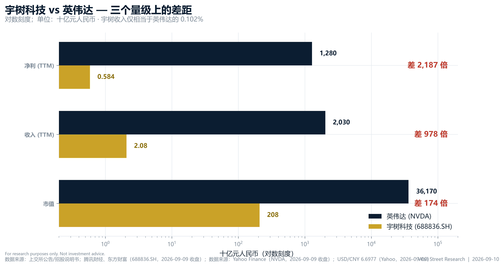
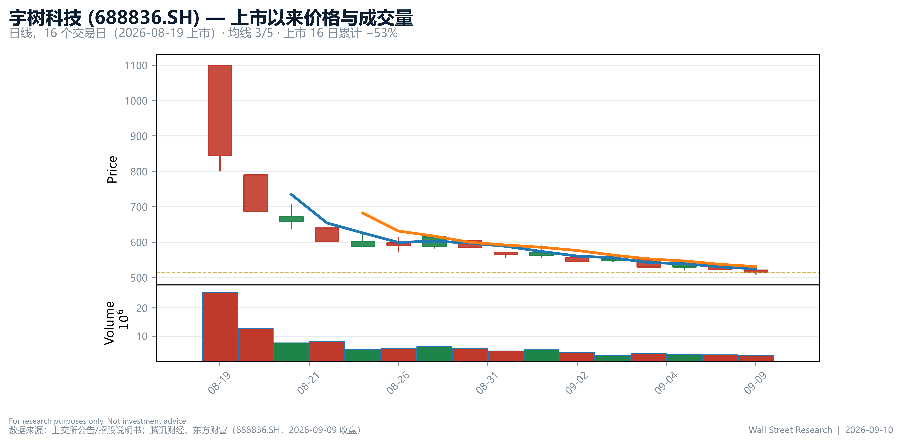
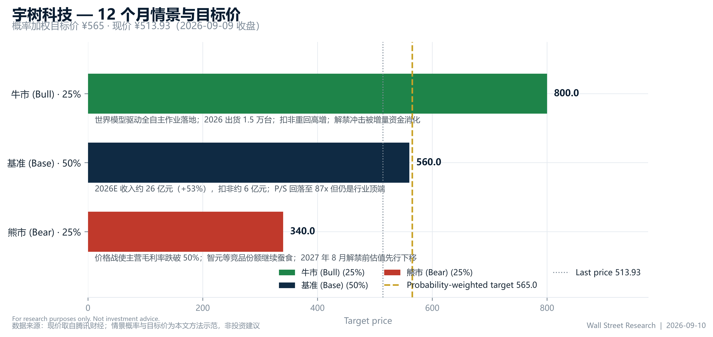

# 摘要

有人问：**宇树科技能不能超越英伟达？**

这是一个真实存在于饭桌上、微信群里、以及某些卖方晨会里的问题。它听起来很燃，但它其实是一个**没定义清楚的问题**——就像问“一只刚学会后空翻的机器狗能不能超越一支军队”。要回答它，先得说清楚用哪把尺子。

我们用四把尺子量了一遍（数据截至 2026-09-09 收盘，宇树 A 股 ¥513.93、英伟达美股 US$223.67，汇率 6.6977）：

| 尺子 | 宇树科技 (688836.SH) | 英伟达 (NVDA) | 差距 | 结论 |
|---|---|---|---|---|
| 市值 | ¥2,079亿（US$31.0B） | US$5.40万亿（¥36.17万亿） | **174×** | 差得很远 |
| 收入（TTM） | ¥20.76亿 | ¥2.03万亿 | **978×** | 差得更远 |
| 归母净利（TTM） | ¥5.84亿 | ¥1.28万亿 | **2,187×** | 远到不像同一道题 |
| 估值倍数（P/S） | 100.1× | 17.8× | 宇树 **5.6×** 于英伟达 | **这一局宇树赢了** |

所以我们的结论是：**“市值/收入/利润超越英伟达”——不能，短期内完全不能；但“在想象力定价上超越英伟达”——它上市第一天就已经做到了。** 而真正值得关心的问题不是“能不能超越英伟达”，而是“宇树能不能在不被价格战打死的前提下，把机器人卖成一台真正的生产工具”。这个问题，才值 355.8 倍市盈率。

**投资摘要（概率加权目标价 ¥565，现价 ¥513.93，+10%）：** 我们给出 12 个月基准目标价 **¥565**（牛/基准/熊 = ¥800 / ¥560 / ¥340，概率 25% / 50% / 25%）。这不是“看好宇树”，恰恰相反：¥565 的隐含 P/S 仍在 87 倍附近，意味着基准情景下**股价能维持全靠增长兑现**。宇树是一家真实的好公司（FY2025 收入 +332.6%，毛利率 60.4%），但它现在是一只**必须每季度交作业的股票**。

# 先把问题问对：什么算“超越”？

“超越”至少可以指四件事，而它们的时间表差了三个数量级：

1. **市值超越**——需要宇树股价再涨 174 倍至 **¥89,437/股**（等价于市值 36 万亿人民币）；
2. **收入超越**——需要宇树收入从 ¥20.76 亿长到 ¥2.03 万亿，即 **978 倍**；
3. **利润超越**——需要 2,187 倍，且假设英伟达零增长；
4. **某个单点的超越**——比如“卖出的机器人数量”（宇树：数以万计；英伟达：0），或“估值倍数”（宇树 100.1× P/S vs 英伟达 17.8×，已经赢麻了）。

把这四件事混在一句话里说，就是“用一把尺子量体温、另一把尺子量身高，然后宣布谁更健康”。

# 第一把尺子：市值——174 倍

宇树当前市值 **¥2,079 亿**（约 US$31.0B）；英伟达 **US$5.40 万亿**（约 ¥36.17 万亿）。倍数：**174×**。

要让两者市值相等，宇树股价需从 ¥513.93 涨到 **¥89,437**——即在 16 个交易日内已经腰斩 53.3% 的股价，还要再涨 173 倍。作为对比，宇树上市首日开盘价 ¥1,100 已经是发行价 ¥150.80 的 7.3 倍；而 174 倍是另一个故事。

有意思的是，宇树的**估值**（而非市值）已经赢了：P/S-TTM **100.1×** 对英伟达 **17.8×**。市场给宇树的，不是它今天的收入，而是“通用机器人”这四个字的看涨期权。**这是 2026 年 A 股最贵的一张彩票，且没有之一。**

# 第二把尺子：收入——978 倍，以及一张时间表

宇树 TTM 收入 **¥20.76 亿**，仅相当于英伟达 TTM 收入（¥2.03 万亿）的 **0.102%**。要在收入上追平英伟达“今天”的水平（假设英伟达原地不动），需要多久？

| 宇树收入年增速 | 追平英伟达今天收入所需年数 |
|---|---|
| 100%（梦幻） | 9.9 年 |
| 60%（乐观） | 14.6 年 |
| 48%（2026H1 实际增速） | 17.4 年 |
| 30%（成熟期） | 26.2 年 |
| 20%（制造业主流） | 37.8 年 |

而如果英伟达也继续增长——它在 TTM 已经同比 +105.9%——这张表会立刻从“追赶”变成“追不上”。

# 第三把尺子：出货量——1:0，宇树领先，但领奖台上站着别人

在“卖出的机器人台数”这一局，宇树 **1 : 0** 领先英伟达——英伟达不造人形机器人，它卖铲子（GPU），不挖金子。

但这里有个更扎心的现实：宇树**也不是出货量第一**。据公开出货量口径，2026 年上半年人形机器人出货量首位是**智元机器人**，宇树退居第二。也就是说，在“自己的主场”上，宇树也已经被对手超了——而它想超越的那家公司，压根不在这个赛道上。

这提醒我们：**宇树的竞争对手不是英伟达，是智元、是优必选、是每一家能造出便宜好用的机器人的公司。**

# 第四把尺子：想象力——这一局宇树已经赢了

英伟达的 P/E-TTM 是 28.3×，P/S 17.8×，是“业绩已经兑现”的估值；宇树的 P/E-TTM 是 355.8×，P/S 100.1×，是“业绩必须兑现”的估值。

英伟达过去一年的估值走廊（均值 24.7×，±1σ 区间 22.7–26.6×，当前 28.3× 处于 P94 分位）说明：**成熟公司的估值是被盈利锚定的**，再疯狂也有边界。宇树没有这条边界——它有的是一个 2,079 亿的“如果”。

# 宇树的真实基本面：一家好公司，一只贵股票

宇树的基本面是真材料，不是 PPT：

- **收入**：FY2023 ¥1.59 亿 → FY2024 ¥3.93 亿（+146.8%）→ FY2025 ¥16.99 亿（+332.6%），两年 CAGR 226.8%；TTM ¥20.76 亿。
- **盈利**：FY2025 归母净利 ¥2.78 亿、扣非净利 ¥5.91 亿；2026H1 归母净利 ¥2.74 亿（同比 +955.6%）。
- **毛利率**：FY2025 60.4% → 2026H1 **56.0%**，方向是往下走的。
- **增速**：2026H1 收入 +48.5%，其中 Q1 +68.5%、**Q2 +39.0%**——环比减速已经发生。

关于“扣非 EPS 从 ¥0.83 降到 ¥0.67”这一点，我们不打算写成“盈利腰斩”：EPS 口径在上市后受股本扩张影响，不可直接同比。但毛利率下滑和季度增速放缓是**真实存在的**，它们共同指向同一件事——**人形机器人正在从“稀缺”走向“卷”**。

# 情景与目标价

| 情景 | 概率 | 12个月目标价 | 触发条件 |
|---|---|---|---|
| 牛市 | 25% | ¥800 | 世界模型驱动的全自主作业落地；2026 出货 1.5 万台；扣非重回高增；解禁冲击被增量资金消化 |
| 基准 | 50% | ¥560 | 2026E 收入约 ¥26 亿（+53%）、扣非约 ¥6 亿；P/S 回落至 87× 但仍是行业顶端 |
| 熊市 | 25% | ¥340 | 价格战使主营毛利率跌破 50%；竞品继续蚕食份额；2027 年 8 月解禁前估值先行下移 |

**概率加权目标价 = ¥565**（现价 ¥513.93，+10%）。

# 风险提示

1. **估值风险**：355.8× P/E、100.1× P/S，任何一次增长不及预期都会被估值放大；
2. **解禁风险**：2027 年 8 月前后为首发原股东解禁窗口，流通盘目前仅 ¥154.63 亿（占总市值 7.4%）；
3. **价格战风险**：2026H1 毛利率已从 60.2% 降至 56.0%，人形机器人“内卷”才刚开始；
4. **竞争风险**：智元等竞品在出货量上已实现反超；
5. **叙事风险**：本报告讨论的“超越英伟达”，本质是叙事而非财务命题——叙事可以一夜之间改写。

# 结论：答案是“不能”，但这个问题本来就不该这么问

**宇树科技不能超越英伟达——在市值、收入、利润三把尺子上，差距分别是 174×、978×、2,187×，这不是十年内能填平的坑。**

**但宇树在“想象力”上已经超越英伟达了：100.1× 的 P/S 对 17.8×，市场愿意为它的未来多付 5.6 倍。**

真正的问题不是“宇树能不能超越英伟达”，而是：

> **“一家把机器人卖出规模的公司，能不能在价格战里守住 56% 的毛利率，并把“能翻跟头”变成“能干活”？“**

这个问题，才配得上 355.8 倍市盈率。而英伟达——它甚至不在这场考试里，它在卖考试的算力。

---

# 披露 / Disclosures

**评级定义：** OVERWEIGHT（预期 12 个月相对收益 > +10%）/ EQUAL-WEIGHT（−10% ~ +10%）/ UNDERWEIGHT（< −10%）。

**数据来源：** 宇树科技——上交所公告、招股说明书、2026 年半年报；腾讯财经 / 东方财富（688836.SH，2026-09-09 收盘）。英伟达——Yahoo Finance（NVDA，2026-09-09 收盘）。汇率 USD/CNY 6.6977（Yahoo Finance，2026-09-09）。

**免责声明：** 本报告为 *wallstreetype-research* 流水线的**方法示范样本**，用于展示”从真实数据到机构级排版“的完整链路。所有情景概率与目标价均为示范用假设，不构成任何投资建议。市场有风险，机器人也会摔倒。

*Wall Street Research | 2026年9月10日*
